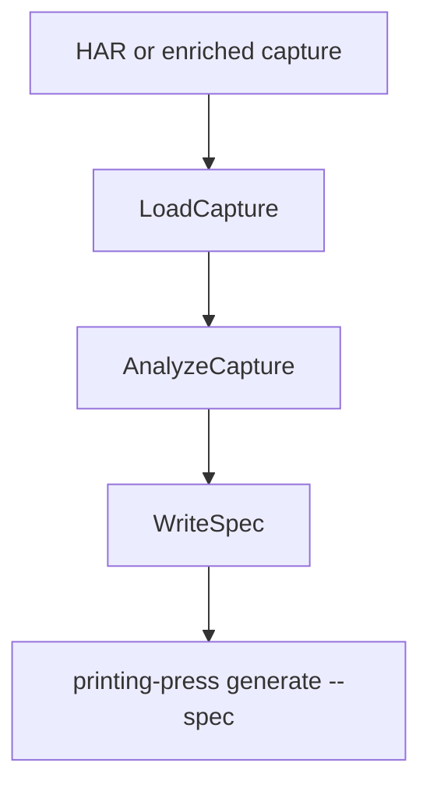
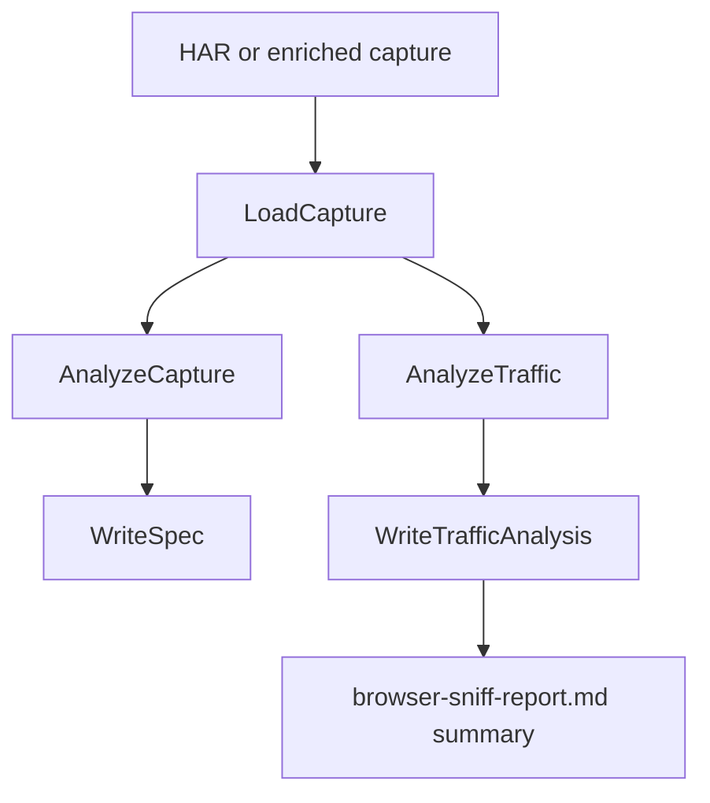

# Add Browser-Sniff Traffic Analysis Artifact

## Overview

Add a structured traffic analysis artifact to `printing-press browser-sniff` so captured browser traffic produces two independent outputs:

- The existing OpenAPI-compatible spec YAML used by `generate`
- A new default-on traffic analysis sidecar that explains what was observed, inferred, and recommended

This plan intentionally keeps the work isolated from client generation improvements. The analysis artifact may identify protocols such as GraphQL, Google-style RPC envelopes, SSR/embedded data, protected web access, or browser-rendered flows, but those labels are advisory observations only. They do not change generated clients, templates, scorer behavior, or runtime client patterns in this task.

The immediate machine improvement is in discovery quality: every browser-sniff manuscript will preserve structured evidence about protocol, auth, protection, request flow, endpoint clusters, and candidate command ideas. That gives Phase 1 research, retros, polish, and future implementation planning better inputs even before the generator consumes the artifact directly.

## Problem Frame

`browser-sniff` currently collapses captured traffic directly into a spec. That is useful when traffic looks like conventional JSON HTTP APIs, but it hides important discovery context:

- Which protocol shapes were observed
- Which endpoints are actual application traffic versus noise
- Whether auth appears to be bearer, API key, cookie, composed cookie/header, or browser-session based
- Whether the target shows WAF, bot protection, CAPTCHA, or browser-only access signals
- Which requests form a sequence rather than independent endpoints
- Which paths are high-value candidates for CLI commands
- What the machine inferred versus what it merely observed
- Whether captured responses contain raw transport envelopes, challenge pages, empty payloads, or other signals that the generated CLI would likely expose bad output

The immediate goal is to preserve this intelligence as a structured manuscript artifact. A later task can consume the artifact to choose specialized client templates or formal protocol archetypes, but this task must not do that.

## Requirements Trace

- R1. `browser-sniff` emits a traffic analysis sidecar from the same capture used to generate the spec.
- R2. Existing spec YAML content remains unchanged; the command now writes an additional sidecar by default.
- R3. The analysis schema records observations, confidence, and source evidence without exposing secret values.
- R4. The analyzer detects at least these categories: protocol signals, auth signals, protection signals, endpoint clusters, request sequence, endpoint size/activity, pagination signals, protocol-leak/weak-capture warnings, and candidate commands.
- R5. The browser-sniff skill writes `traffic-analysis.json` into `discovery/` during a browser-sniff run, treats it as part of discovery evidence, and includes a short summary in `browser-sniff-report.md`.
- R6. Tests cover representative REST, GraphQL, RPC-envelope, SSR/HTML, protected-web, and auth-signal captures.
- R7. `go test ./...` passes after the change.

## Scope Boundaries

- No generator template changes.
- No new printed CLI client pattern.
- No formal protocol archetype system.
- No scorecard, dogfood, or verify behavior changes.
- No runtime anti-bot bypass or browser automation implementation changes.
- No attempt to generate a better spec from the analysis in this task.
- No network probing. The analyzer only reads the capture file it is given.
- No storage of raw credential values in the analysis output.
- No `generate`-time dependency on `traffic-analysis.json`. The discovery workflow uses and archives it now; generator consumption is deferred.
- No verify or scorecard enforcement based on analyzer warnings. This task records warnings as discovery evidence only.

### Deferred to Separate Tasks

- Consuming `google_batchexecute` or other RPC-envelope observations to generate specialized clients.
- Turning protocol observations into a formal archetype/template selection system.
- Making verify or scorecard consume protocol-leak/weak-capture warnings.
- Adding protected-web runtime client support.
- Improving browser-auth capture or cookie-domain priority rules.

## Context & Research

### Relevant Code and Patterns

- `internal/cli/browser_sniff.go` defines the `browser-sniff` command, loads captures, optionally imports auth via `--auth-from`, calls `browsersniff.AnalyzeCapture`, writes the spec, and prints the generated endpoint count.
- `internal/browsersniff/capture.go` loads either raw HAR or enriched capture JSON into `EnrichedCapture`.
- `internal/browsersniff/types.go` defines the HAR and enriched capture structs. The current structs do not retain HAR timing fields in `EnrichedEntry`, so sequence analysis must either extend the optional fields and parser mapping or fall back to capture order.
- `internal/browsersniff/classifier.go` separates API traffic from noise using JSON/content-type/path/blocklist scoring, then deduplicates endpoints.
- `internal/browsersniff/specgen.go` converts classified entries into an internal `spec.APISpec`, including auth inference, base URL selection, endpoint naming, and schema inference.
- `internal/browsersniff/schema.go` already contains request/response schema inference helpers that the analysis layer can reuse for shape summaries.
- `internal/cli/browser_sniff_test.go` covers command registration, legacy command rejection, and `--auth-from` domain binding.
- `internal/browsersniff/*_test.go` contains package-level tests for parsing, classification, schema inference, fixture generation, and spec generation.
- `skills/printing-press/references/browser-sniff-capture.md` owns the skill-side capture flow and report writing. This is where the generated `traffic-analysis.json` should be requested and summarized.
- `docs/plans/2026-03-30-001-feat-discovery-manuscript-provenance-plan.md` established `discovery/` as the manuscript home for browser-sniff evidence.
- `docs/plans/2026-04-18-002-refactor-rename-sniff-to-browser-sniff-plan.md` established the current command and artifact naming.

### Current Behavior

The current command flow is:

The planned behavior adds a sidecar branch while preserving the existing branch:

### How This Improves The Machine Now

This plan improves the printing press through discovery, not through client codegen yet:

- **Research briefs and browser-sniff reports get better evidence.** The skill can summarize observed protocols, auth, protections, candidate commands, and warnings from a structured artifact instead of relying only on prose notes and raw captures.
- **Retros become more actionable.** A failed or low-quality printed CLI can be traced back to captured signals such as "GraphQL endpoint with operation names", "HTML challenge page", "cookie-session auth", or "RPC envelope returned raw transport frames".
- **Future generator work gets stable input.** Later tasks can consume protocol labels and generation hints without re-parsing HAR files or inventing a schema after the fact.
- **Discovery quality becomes testable.** The analyzer adds Go tests for protocol/auth/protection detection, moving important browser-sniff intelligence out of skill prose and into executable checks.
- **Bad captures are visible earlier.** Analyzer warnings can flag raw RPC envelopes, GraphQL error-only bodies, HTML challenge pages, empty payloads, and weak schema evidence before those mistakes become printed CLI behavior.
- **Manuscripts become more auditable.** A reviewer can inspect `discovery/traffic-analysis.json` to see what was observed and how confident the machine was before deciding whether the generated spec is trustworthy.

## Key Technical Decisions

- **D1: Analysis sidecar, not generation input.** The new artifact is written beside the generated spec and is not read by `generate`. This preserves isolation from client template work and keeps the first implementation reviewable.
- **D2: Default-on sidecar with path override.** Add `--analysis-output <path>` to `browser-sniff`. When omitted, derive the analysis path from the spec output path. The skill still passes this flag explicitly so manuscript location is stable.
- **D3: Keep spec inference and traffic analysis separate.** Add a new analysis entry point instead of modifying `AnalyzeCapture` to return a larger composite. The spec path remains stable; the analysis path can evolve without destabilizing generation.
- **D4: Store evidence references, not secrets.** Analysis may include method, host, path, query parameter names, header names, cookie names, status, content type, body shape summaries, and sample-size metadata. It must not include auth header values, cookie values, API keys, tokens, or full request/response bodies.
- **D5: Confidence is explicit.** Every higher-level inference should carry a confidence value and evidence pointers. Low-confidence observations are still useful, but the artifact must not make them look certain.
- **D6: Sequence detection degrades gracefully.** If HAR timing is present, use it. If only enriched capture order is available, report order-based sequences with lower confidence. If neither signal is reliable, report that sequence analysis is unavailable.
- **D7: Protocol labels are stable strings.** Use forward-compatible labels such as `rest_json`, `graphql`, `rpc_envelope`, `google_batchexecute`, `json_rpc`, `trpc`, `grpc_web`, `websocket`, `sse`, `firebase`, `ssr_embedded_data`, `html_scrape`, and `browser_rendered`. This does not make them archetypes yet; it gives later work stable names to consume.

## High-Level Technical Design

The new package surface should stay small:

- `AnalyzeTraffic(capture *EnrichedCapture) (*TrafficAnalysis, error)`
- `WriteTrafficAnalysis(analysis *TrafficAnalysis, outputPath string) error`

The schema should be oriented around review and future consumption:

- `summary`: target URL, capture counts, API/noise counts, host distribution, time span when known
- `protocols`: observed protocol labels, confidence, evidence entries, and transport details
- `auth`: auth type candidates, cookie/header/query names, domain hints, session-only signals, confidence
- `protections`: WAF/bot/CAPTCHA/browser-only signals, status/code/header evidence, recommended handling notes
- `endpoint_clusters`: method/path/host groups, observed statuses, content types, size class, request/response shape summaries
- `request_sequences`: ordered flows and redirect/session transitions when inferable
- `pagination`: query/body/header signals such as `page`, `cursor`, `limit`, `offset`, `after`, `before`, `next`
- `candidate_commands`: suggested command names with rationale and confidence, derived from endpoint clusters and observed verbs
- `generation_hints`: advisory hints such as `requires_browser_auth`, `requires_js_rendering`, `requires_protected_client`, `has_rpc_envelope`
- `warnings`: analysis limitations, redaction notes, unavailable timing, raw protocol envelopes, GraphQL error-only bodies, HTML challenge pages, suspicious empty responses, weak schema evidence, or unsupported content types

Field names should remain generic. For example, protocol-specific details belong under a `details` map or typed nested struct that can be omitted when irrelevant, not as top-level one-off fields.

## Open Questions

### Resolved During Planning

- Should this work change generated client behavior? No. The artifact is analysis/reporting only.
- Should protocol labels become formal generator archetypes now? No. Use stable advisory labels only.
- Should the artifact be written by default for every command invocation? Yes. The sidecar is the value of the feature; `--analysis-output` controls the path rather than enabling the feature.
- Should the skill store the artifact in `research/` or `discovery/`? Use `discovery/`; it is evidence from browser traffic capture.

### Deferred to Implementation

- Exact threshold values for confidence scoring. The implementation should start conservative and adjust based on tests.
- Whether response shape summaries should reuse existing `InferResponseSchema` directly or wrap it with a lighter analysis-specific shape.
- Whether raw HAR `startedDateTime` and `time` fields are available in all expected captures. If not, sequence analysis falls back to entry order.

## Implementation Units

- [x] **Unit 1: Define traffic analysis data model and writer**

**Goal:** Add the structured JSON artifact shape without changing classification or spec generation behavior.

**Requirements:** R1, R3, R4

**Dependencies:** None

**Files:**
- Add: `internal/browsersniff/analysis.go`
- Add: `internal/browsersniff/analysis_test.go`
- Modify: `internal/browsersniff/types.go`
- Modify: `internal/browsersniff/parser.go`

**Approach:**
- Define `TrafficAnalysis` and nested structs in `analysis.go`.
- Add `AnalyzeTraffic(capture *EnrichedCapture)` and `WriteTrafficAnalysis(...)`.
- Extend HAR and `EnrichedEntry` structs with optional timing fields only if needed for sequence analysis, then map them in `convertHAREntry`. Keep JSON tags optional so existing fixtures remain valid.
- Keep all new code independent from `AnalyzeCapture`; the only shared dependency should be existing helper functions such as `ClassifyEntries`, `DeduplicateEndpoints`, `extractHost`, `extractPath`, and schema inference helpers.
- Redact by construction: store auth header names, cookie names, and query parameter names, never values.

**Execution note:** Characterization-first. Before broad detector work, add one test proving the existing sample capture still analyzes without changing spec behavior.

**Patterns to follow:**
- `WriteSpec` in `internal/browsersniff/specgen.go` for output directory creation and JSON/YAML write error style.
- `AnalyzeCapture` in `internal/browsersniff/specgen.go` for nil-capture validation and use of `ClassifyEntries`.

**Test scenarios:**
- Happy path: `AnalyzeTraffic` on `testdata/sniff/sample-enriched.json` returns summary counts, at least one endpoint cluster, and no secret values.
- Edge case: empty capture returns a valid analysis with zero counts, warnings, and no panic.
- Error path: nil capture returns a clear `capture is required` error.
- Security: an entry with `Authorization`, `Cookie`, and query token values produces only names/type hints in JSON, not the sensitive values.
- Compatibility: existing `AnalyzeCapture` tests continue to pass unchanged.

**Verification:**
- `go test ./internal/browsersniff/...` passes.
- Generated JSON is deterministic enough for assertions without depending on map iteration order.

- [x] **Unit 2: Implement protocol, auth, protection, and endpoint detectors**

**Goal:** Populate the analysis artifact with useful observations and discovery warnings from captured traffic.

**Requirements:** R3, R4, R6

**Dependencies:** Unit 1

**Files:**
- Modify: `internal/browsersniff/analysis.go`
- Modify: `internal/browsersniff/analysis_test.go`
- Add or modify: `testdata/sniff/*` fixtures as needed

**Approach:**
- Implement detectors as small internal helpers called by `AnalyzeTraffic`; avoid a large monolithic function.
- Protocol detection should inspect method, path, query names, request content type, request body shape, response content type, upgrade headers, and body envelopes.
- Auth detection should combine captured auth (`capture.Auth`) with observed request headers/query/cookie names.
- Protection detection should inspect status codes, response content type, headers, and HTML/body markers for WAF, bot challenge, CAPTCHA, login redirects, and browser-only rendering.
- Endpoint clusters should be based on `DeduplicateEndpoints` and should include host, method, normalized path, observed statuses, content types, count, size class, request shape, and response shape.
- Pagination detection should inspect query parameters, JSON body fields, response fields, and link headers.
- Warning detection should identify captured responses that are likely to produce bad printed CLI behavior if treated as clean domain data: raw RPC transport markers, GraphQL error-only payloads, HTML challenge/login pages, empty or null bodies on high-value API-looking requests, binary/protobuf bodies with weak schema evidence, and repeated 4xx/5xx responses inside endpoint clusters.
- Candidate commands should be conservative and based on normalized path/resource names, HTTP method, observed operation shape, and protocol-specific labels. Suggestions are advisory and may be empty.

**Patterns to follow:**
- `scoreEntry` in `internal/browsersniff/classifier.go` for rule-based scoring.
- `inferURLParams`, `inferRequestBody`, and `InferResponseSchema` for shape-oriented inference.

**Test scenarios:**
- Happy path: REST JSON capture reports `rest_json`, endpoint clusters, query pagination hints, and list/get-style candidate commands.
- Happy path: GraphQL capture reports `graphql`, operation names when present, and a single endpoint cluster with operation-level details.
- Happy path: RPC-envelope capture reports `rpc_envelope` and, when request fields match known Google-style envelope signals, `google_batchexecute` as an additional protocol label.
- Happy path: HTML/SSR capture with embedded JSON reports `ssr_embedded_data` or `html_scrape` and warns when no clean JSON API endpoint is observed.
- Happy path: protected-web capture with challenge/status/header/body markers reports protection observations and `requires_protected_client` hint.
- Happy path: raw RPC-envelope or transport-framed responses produce a warning that generated output may leak protocol artifacts.
- Happy path: GraphQL error-only response produces a warning distinct from ordinary GraphQL protocol detection.
- Happy path: API-looking request that returns an HTML challenge/login page produces both a protection signal and a weak-capture warning.
- Edge case: mixed analytics/noise plus API traffic keeps noise out of endpoint clusters but includes a summary noise count.
- Edge case: WebSocket or SSE headers produce protocol observations without pretending there is a normal request/response endpoint body.
- Edge case: empty/null payloads on high-value API-looking requests produce a warning without causing analysis failure.
- Security: auth and protection detectors do not leak credential values from headers, cookies, query params, request bodies, or response bodies.

**Verification:**
- Detector tests cover each required protocol/protection/auth category.
- Existing classifier and spec generation tests still pass without assertion changes caused by detector side effects.

- [x] **Unit 3: Add CLI flag and command output integration**

**Goal:** Write the sidecar artifact by default while preserving current spec YAML content.

**Requirements:** R1, R2, R7

**Dependencies:** Units 1 and 2

**Files:**
- Modify: `internal/cli/browser_sniff.go`
- Modify: `internal/cli/browser_sniff_test.go`

**Approach:**
- Add `--analysis-output <path>` to `browser-sniff`.
- After auth import and before or after spec generation, call `browsersniff.AnalyzeTraffic(capture)` for every successful command run.
- If `--analysis-output` is omitted, derive the sidecar path from the spec output path. For example, `--output /tmp/example-spec.yaml` writes `/tmp/example-spec-traffic-analysis.json`. If `--output` is omitted, derive the sidecar beside the default cache spec path.
- Write the analysis with `WriteTrafficAnalysis`.
- Preserve the current success lines for spec generation and add one additional success line for the analysis path.
- Ensure `--name` affects only the generated spec/config path unless the analysis summary needs a display name field. The analysis should primarily describe the capture, not the chosen API slug.
- Do not introduce a cross-file transaction mechanism in this task. If either write fails, the command returns an error; callers may need to clean up any partial file just as they already would for interrupted spec writes.

**Patterns to follow:**
- Existing `--output`, `--name`, `--blocklist`, and `--auth-from` flag handling in `internal/cli/browser_sniff.go`.
- Existing command tests in `internal/cli/browser_sniff_test.go`.

**Test scenarios:**
- Happy path: `browser-sniff --har sample-enriched.json --output spec.yaml --analysis-output traffic-analysis.json` writes both files at explicit paths.
- Happy path: omitting `--analysis-output` writes the spec plus a derived `spec-traffic-analysis.json` sidecar.
- Error path: invalid analysis output directory or unwritable output path returns `writing traffic analysis: ...` without swallowing spec-generation errors.
- Error path: `--auth-from` domain mismatch still fails before any analysis file is written.
- Integration: analysis output contains the same capture auth imported via `--auth-from` as the spec generation path sees, with values redacted.

**Verification:**
- `go test ./internal/cli/... ./internal/browsersniff/...` passes.
- The command help documents `--analysis-output`.

- [x] **Unit 4: Wire the sidecar into the browser-sniff skill and report**

**Goal:** Make the normal browser-sniff workflow archive and summarize the new artifact.

**Requirements:** R5

**Dependencies:** Unit 3

**Files:**
- Modify: `skills/printing-press/references/browser-sniff-capture.md`
- Modify: `skills/printing-press/SKILL.md` only if command examples or phase contracts outside the reference need to mention the sidecar

**Approach:**
- When the skill invokes `printing-press browser-sniff`, pass `--analysis-output "$DISCOVERY_DIR/traffic-analysis.json"` even though the command has a default. This keeps manuscript artifact names stable and avoids deriving a path from whatever spec filename the phase uses.
- Add `traffic-analysis.json` to the list of expected discovery artifacts.
- Update `browser-sniff-report.md` instructions to include a concise "Traffic Analysis" section summarizing protocols, auth signals, protection signals, candidate commands, generation hints, and warnings.
- Keep the report summary human-readable; the structured JSON is the source of truth for future machine consumption.
- Do not require the sidecar for non-browser-sniff generation paths.

**Patterns to follow:**
- Existing `browser-sniff-report.md` generation instructions in `skills/printing-press/references/browser-sniff-capture.md`.
- Existing discovery artifact archival expectations from prior discovery manuscript work.

**Test scenarios:**
- Test expectation: none in Go for markdown-only skill changes. Verify with textual review and a manual browser-sniff dry run when implementing.

**Verification:**
- A browser-sniff run writes `discovery/traffic-analysis.json`.
- The archived manuscript includes `discovery/traffic-analysis.json`.
- `browser-sniff-report.md` includes a Traffic Analysis section that summarizes the JSON without duplicating raw sensitive data.

- [x] **Unit 5: Add fixture coverage and documentation guardrails**

**Goal:** Ensure the new analyzer remains isolated, covered, and understandable to future implementers.

**Requirements:** R2, R6, R7

**Dependencies:** Units 1-4

**Files:**
- Modify: `internal/browsersniff/analysis_test.go`
- Add or modify: `testdata/sniff/*` fixtures as needed
- Modify: `README.md` or another live user-facing doc only if it already documents `browser-sniff` command outputs

**Approach:**
- Prefer small synthetic captures for protocol-specific tests over large real HAR fixtures.
- Keep fixture names generic and protocol-focused, such as `graphql-enriched.json`, `rpc-envelope-enriched.json`, `protected-web-enriched.json`, and `ssr-html-enriched.json`.
- Add tests that explicitly assert the sidecar does not alter the spec output for the existing sample fixture.
- Add a short doc note that `traffic-analysis.json` is default browser-sniff discovery evidence, not a generation or verification contract.

**Patterns to follow:**
- Existing `testdata/sniff/sample-enriched.json` fixture style.
- Existing browser-sniff tests that use `filepath.Join("..", "..", "testdata", "sniff", ...)`.

**Test scenarios:**
- Happy path: each fixture maps to the expected protocol/protection/auth observations.
- Happy path: weak-capture fixtures map to expected warnings without changing generated spec behavior.
- Edge case: fixtures with no timing still produce order-based or unavailable sequence analysis rather than failing.
- Edge case: fixtures with large bodies produce shape summaries and size metadata, not full bodies.
- Regression: the sample fixture still produces the same valid spec via `AnalyzeCapture`.
- Documentation: any live doc update avoids promising generator behavior that this task does not implement.

**Verification:**
- `go test ./...` passes.
- No test fixture contains real credentials, cookies, or private response data.
- `rg "traffic-analysis.json|analysis-output" README.md skills/ internal/ docs/plans/2026-04-21-001-feat-browser-sniff-traffic-analysis-plan.md` shows intentional, consistent terminology.

## System-Wide Impact

- **Interaction graph:** The new code touches `internal/browsersniff`, `internal/cli/browser_sniff.go`, and the browser-sniff skill reference. The generator, templates, scorecard, dogfood, verify, and printed CLI runtime code remain unchanged.
- **Error propagation:** Analysis write failures should fail the command because the sidecar is part of browser-sniff output. The generated spec content remains independent, but the command reports failure if it cannot write either artifact.
- **State lifecycle risks:** The skill writes the sidecar into `discovery/`, which existing manuscript archival already treats as optional evidence. Non-browser-sniff runs do not create this artifact.
- **API surface parity:** The only user-facing CLI addition is `--analysis-output`. There is no generated printed CLI API surface change.
- **Integration coverage:** CLI tests prove dual-output behavior. Package tests prove detector behavior. Skill changes need manual dry-run verification because they are markdown workflow instructions.
- **Unchanged invariants:** `AnalyzeCapture` still returns `*spec.APISpec`; `WriteSpec` still writes YAML; generated clients do not read `traffic-analysis.json`.

## Risks & Dependencies

| Risk | Mitigation |
|------|------------|
| Analysis schema becomes too specific to one protocol | Use generic observation structures, stable labels, details maps, and confidence/evidence fields. |
| Detector confidence looks more certain than it is | Require confidence and evidence on inferred observations; put uncertain claims in warnings or low-confidence entries. |
| Sensitive data leaks into `traffic-analysis.json` | Redact by construction and add tests with auth headers, cookies, query tokens, and request-body tokens. |
| Sequence analysis is unreliable without timing | Add optional timing fields when available and explicitly fall back to order-based or unavailable sequence reporting. |
| Warnings look like hard failures even though enforcement is deferred | Label warnings as discovery evidence and document that verify/scorecard consumption is a separate task. |
| Dual-output command leaves a partial file after an interrupted or failed write | Treat this as acceptable for this sidecar task; surface the write error clearly and avoid adding transaction machinery. |
| Existing `browser-sniff` users see changed behavior | Treat the sidecar as intentional additive output, derive its default path predictably, and preserve current spec YAML content. |
| Fixture set becomes large and hard to review | Use small synthetic enriched captures focused on one detector category each. |
| Skill report duplicates structured JSON and drifts | Keep the report as a summary only; `traffic-analysis.json` is the structured source of truth. |

## Documentation / Operational Notes

- The new artifact belongs in `discovery/traffic-analysis.json`.
- The browser-sniff report should mention the sidecar when it exists.
- Live docs should describe the artifact as diagnostic discovery evidence, not as a new generation contract.
- Analyzer warnings should be described as discovery signals, not publish blockers.
- The artifact may become an input to future work, but no current workflow should require downstream consumers to read it.

## Success Metrics

- A reviewer can inspect a browser-sniff manuscript and understand protocol, auth, protection, and command-candidate observations without re-reading the raw HAR.
- Existing browser-sniff spec generation tests pass unchanged.
- The new analyzer test suite covers all required detector categories.
- Weak-capture and protocol-leak warnings are present in the sidecar for representative fixtures but do not change `generate`, verify, or scorecard behavior.
- The generated JSON never includes known test secret values.
- The command writes the sidecar by default, and the skill archives it as `discovery/traffic-analysis.json` during browser-sniff runs.

## Sources & References

- Related code: `internal/cli/browser_sniff.go`
- Related code: `internal/browsersniff/capture.go`
- Related code: `internal/browsersniff/types.go`
- Related code: `internal/browsersniff/classifier.go`
- Related code: `internal/browsersniff/specgen.go`
- Related tests: `internal/cli/browser_sniff_test.go`
- Related tests: `internal/browsersniff/*_test.go`
- Skill workflow: `skills/printing-press/references/browser-sniff-capture.md`
- Prior plan: `docs/plans/2026-03-30-001-feat-discovery-manuscript-provenance-plan.md`
- Prior plan: `docs/plans/2026-04-18-002-refactor-rename-sniff-to-browser-sniff-plan.md`
