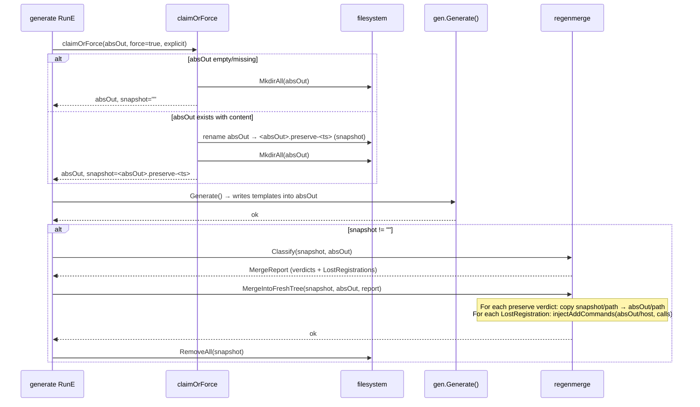

# fix: --force regen preserves hand-edits to templated files and parent-command AddCommands

## Summary

Wire the existing AST-aware `internal/pipeline/regenmerge` classifier into the `printing-press generate --force` regen flow so hand-edits to templated files (`internal/client/*.go`, `internal/config/*.go`, `internal/cli/<resource>.go`) survive regeneration. Add a literal-value-drift verdict to `regenmerge` so const/var literal hand-edits (the canonical `"Bearer "`→`"Token "` case) are preserved instead of silently overwritten. Reuse `regenmerge`'s `LostRegistrations` machinery to re-inject `cmd.AddCommand(...)` lines that agents add to parent-command files.

---

## Problem Frame

Issue [#907](https://github.com/mvanhorn/cli-printing-press/issues/907) (P1, filed by Monarch Money retro): `printing-press generate --force` clobbers hand-edits to four file shapes that have the `Generated by CLI Printing Press` marker:

1. `internal/client/queries.go` — agent replaced placeholder GraphQL with 27 hand-authored operations.
2. `internal/client/graphql.go` — agent set `const graphqlEndpointPath = "/graphql"` (was empty).
3. `internal/config/config.go` — agent changed `"Bearer "` to `"Token "` to match the auth prefix.
4. `internal/cli/transactions.go` — agent added `cmd.AddCommand(newXxxNovelCmd(flags))` for novel features.

PR #897 (commit `dceb6e58`, just landed) preserves files **without** the marker (novel hand-written files) and fully-novel sibling packages, but anything carrying the marker is still wiped. Polish triggers regen on every CLI, so this hits every published CLI with hand-edits — making it a P1 against the polish workflow.

The fix is a machine change: per AGENTS.md "machine vs printed CLI", every printed CLI benefits from getting `--force` right once.

---

## Requirements

- R1. Hand-edited generator-emitted files in `internal/client/`, `internal/config/`, and `internal/cli/` survive `printing-press generate --force` when they have decl-set additions, body-call-target drift, or any per-decl text drift (including literal-value or identifier-rename drift) relative to the fresh emission.
- R2. Hand-added `cmd.AddCommand(...)` lines in parent-command files (`internal/cli/<resource>.go`) and in `internal/cli/root.go` survive `--force` via AST-based re-injection into the freshly emitted file.
- R3. Untouched generator-emitted files are still regenerated when the underlying template legitimately changes (no glob freezes the world).
- R4. Existing PR #897 contract is preserved: novel `internal/cli/*.go` files (no marker), novel sibling packages, and symlink refusals all continue to work.
- R5. Failure mid-regen leaves recoverable state — the snapshot directory is the recovery path; cleanup happens only after merge succeeds. Symlink-refusal exits BEFORE any destructive mutation.
- R6. The polish skill needs no changes; it picks up the new contract by re-running `generate --force` (or whatever it invokes today).
- R7. Cross-spec regen (running `--force` with a different spec than the prior generation) does not trigger heuristic preservation — the snapshot's spec hash is compared to the new spec's hash; on mismatch the merge falls back to PR #897 behavior (preserve only NOVEL files, no AST-based decl-set or value-drift heuristics).
- R8. Non-Go user-edited files (e.g. `README.md`, `Makefile`, `.printing-press.json`) under non-generator-owned directories survive `--force` (the PR #897 sibling-package contract — keep parity).
- R9. Hand-added `require`/`replace` directives in `go.mod` for novel-package dependencies (e.g. `modernc.org/sqlite` added to back a hand-written SQLite store) survive `--force` via the existing `renderMergedGoMod` path that the publish-library `regen-merge` flow already uses.

---

## Scope Boundaries

- Polish skill (`skills/printing-press-polish/`) is not modified.
- Generator templates (`internal/generator/templates/*.tmpl`) are not modified.
- Generator output for fresh first-run generation is unchanged — golden fixtures under `testdata/golden/` should not move.
- No new spec extensions, catalog fields, or manifest fields.
- No changes to `printing-press regen-merge` subcommand UX (`internal/cli/regen_merge.go`); the literal-drift verdict shows up in its report automatically because both surfaces share the classifier.
- No backfill regen of the public library; downstream consumers will pick up the fixed semantics on their next regen.

### Deferred to Follow-Up Work

- **Mechanical deletion of PR #897 helpers** (`preserveHandAuthoredInternalCLIFiles`, `preserveHandAuthoredInternalSiblingDirs`, `restorePreservedFiles`, `restorePreservedDirs`, `preservedFile`, `preservedDir`, `generatorOwnedInternalDirs`, `generatorOwnsInternalDir`, `dirContainsGeneratedMarker`, `cleanupPreservedDirs`, `movePreservedDir`, `copyPreservedDir`). Land in a follow-up PR after one polish-cycle of soak validates the snapshot/merge flow.
- **`--strict` / `--no-merge` opt-out flag** for `--force` if drift false positives become noisy in practice. No evidence yet.
- **Cross-spec preservation policy beyond NOVEL-only.** When spec hashes differ, today's plan falls back to PR #897's NOVEL-only behavior. A future iteration could allow per-decl matching across renames (e.g., `getFoo` → `getFooV2` when decl-set diff is small) but that's a research project, not a fix.
- **Capturing the new institutional knowledge**: AST decl-set classification, sibling-tempdir snapshot pattern, AddCommand re-injection, cross-spec guard. After this lands, write a `docs/solutions/` entry per the learnings researcher's recommendation.
- **Cross-repo coordination test against `printing-press-library` mirror regen** — verify the change against ≥3 published CLIs before merging the PR (manual smoke; not blocked by this plan, but called out in the rollout notes).

---

## Context & Research

### Relevant Code and Patterns

- `internal/cli/root.go:claimOrForce` (line 769) — current `--force` orchestration. Calls `preserveHandAuthoredInternalCLIFiles` (line 834), `preserveHandAuthoredInternalSiblingDirs` (line 887), `RemoveAll` (line 780), then restores. This is the splice point.
- `internal/pipeline/regenmerge/regenmerge.go` — Verdict enum (TEMPLATED-CLEAN, TEMPLATED-WITH-ADDITIONS, TEMPLATED-BODY-DRIFT, NOVEL, NEW-TEMPLATE-EMISSION, PUBLISHED-ONLY-TEMPLATED, NOVEL-COLLISION) and `MergeReport` shape. Add the new TEMPLATED-VALUE-DRIFT verdict here.
- `internal/pipeline/regenmerge/classify.go:decideBothPresent` (line 225) — file classification decision tree. Insert literal-drift detection after the existing body-drift check.
- `internal/pipeline/regenmerge/body_drift.go:detectBodyDrift` (line 15) — call-target identifier comparison; the literal-drift detector is a peer to this.
- `internal/pipeline/regenmerge/registrations.go:extractLostRegistrations` (line 38) — extracts published `AddCommand` calls missing from fresh, with referent-existence filtering. Reuse as-is.
- `internal/pipeline/regenmerge/apply.go:injectAddCommands` (line 256) — `dave/dst` AST rewriter that inserts AddCommand calls before the function's trailing return. Reuse.
- `internal/pipeline/regenmerge/apply.go:Apply` (line 42) — stage-and-swap-with-recovery template for the new in-place merge helper. Borrow staging-as-sibling-tempdir, EXDEV-safe move, and per-verdict file mutation. We do NOT need the full bak-recovery rename because the snapshot is the recovery path.
- `internal/cli/generate_test.go:TestGenerateCmdForcePreservesHandAuthoredInternalCLI` (line 21) — pattern for force-preservation tests; new tests follow this shape.
- `internal/cli/generate_test.go:TestMovePreservedDirFallsBackWhenRenameCrossesDevices` (line 268) — EXDEV-fallback test; the new snapshot move uses the same pattern.
- `internal/generatedmarker/marker.go:HasInFile` — first-5-lines marker check. Used unchanged by classify.go.
- `internal/pipeline/regenmerge/helpers.go:writeFileAtomic` — atomic file write via tmp+rename. Use for any new file writes.

### Institutional Learnings

- **`docs/solutions/conventions/preserve-original-authorship-in-multi-author-retrofits-2026-05-06.md`** (high severity) — direct precedent: existing on-disk hand-edited content wins over template emission; prefer noisy preservation with a warning over silent overwrite. Apply this principle to the literal-drift case where the verdict is genuinely ambiguous.
- **`docs/solutions/conventions/soft-validation-in-reusable-library-packages-2026-05-06.md`** (medium) — `regenmerge` is shared by CLI, mcpsync, tests, and now `--force`. New required inputs warn-and-fallback; do not hard-fail.
- **`docs/solutions/best-practices/cross-repo-coordination-with-printing-press-library-2026-05-06.md`** (medium) — running a local-mirror regen against `printing-press-library` before merge is the cheapest way to catch downstream breakage. Logged in operational notes.
- **`docs/plans/2026-05-01-001-feat-regen-merge-subcommand-plan.md`** — the original `regenmerge` plan; this plan extends rather than reinvents.
- **AGENTS.md (`Code & Comment Hygiene`, `Testing`, `Generator Output Stability`)** — no comments restating field/function names; categorical strings → typed const at introduction; run `scripts/golden.sh verify` if generation output could move (it shouldn't here, but verify).

### External References

None needed — fully solvable in-codebase from existing `regenmerge` patterns and Go AST utilities.

---

## Key Technical Decisions

- **Use `regenmerge` for `--force` instead of writing a parallel preserver.** `regenmerge` is well-tested, AST-aware, and already handles the four core verdicts plus AddCommand re-injection. Wiring it in is the smallest change that solves R1, R2, and R4 simultaneously and keeps a single source of truth for "what counts as a hand edit." Considered alternative — record a content hash in the marker / sidecar and use it for "safe to overwrite" detection — see Alternative Approaches below.
- **Add the literal/identifier-drift verdict in `regenmerge` itself, not only in the `--force` path (Option A from the brief).** The `regen-merge` subcommand has the same gap. Putting the fix in the classifier benefits both surfaces and keeps verdict semantics co-located.
- **Detection mechanism: render each top-level decl via `go/printer` (Doc-stripped) and compare canonical text per-decl; differ → TEMPLATED-VALUE-DRIFT.** Per-decl `go/printer` output is canonical (whitespace/comment-stable) so cosmetic diffs don't trigger; any semantic difference does. This catches:
  - Basic-literal value changes (`"Bearer "` → `"Token "`).
  - Identifier renames in selector position (`cfg.Bearer` → `cfg.Token`) — adversarial review caught this gap in a BasicLit-only walker.
  - Type-conversion drift (`MyType(x)` → `MyOtherType(x)`).
  - Composite-literal field key/value drift.
  - Any other AST shape difference inside the decl that `go/printer` would render differently.
  We exclude the marker comment / Copyright header by walking each decl's body and stripping the decl's `Doc` field before printing. Verdict name reflects the broader scope: `TEMPLATED-VALUE-DRIFT` covers both literal and identifier drift inside templated decls.
- **Cross-spec guard: compare snapshot's spec hash to the new spec's hash; on mismatch, fall back to PR #897 NOVEL-only preservation.** A `--force` run against a different spec is a legitimate user workflow (spec evolution, fixed schema). The classifier's heuristics are not valid across specs — a renamed endpoint would TEMPLATED-WITH-ADDITIONS-preserve the stale file and clobber the fresh emission, producing a fused old+new CLI. The guard reads `<snapshot>/.printing-press.json` (the manifest) for the spec source-of-truth, computes a sha256 over the post-redaction fresh spec bytes, and compares. Match → full AST merge. Mismatch → preserve only NOVEL files (no marker) and novel sibling packages (PR #897 contract); skip TEMPLATED-WITH-ADDITIONS / BODY-DRIFT / VALUE-DRIFT preservation and skip AddCommand re-injection. Cross-spec preservation can be improved in a follow-up; the guard's role here is protecting against silent data corruption.
- **Snapshot strategy for `--force`: rename existing absOut to a sibling tempdir before generation, then run merge after generation completes.** This mirrors `regenmerge.Apply`'s staging pattern (`<base>.regen-merge-<ts>/`), gets same-FS rename atomicity for free, and gives us a recovery path (the snapshot dir) if anything fails mid-merge. We avoid `os.MkdirTemp("", ...)` because it can land on a different filesystem (the EXDEV path PR #897 had to add to dodge this).
- **Symlink-refusal happens BEFORE the destructive rename, not after.** lstat absOut, absOut/internal, absOut/internal/cli BEFORE renaming to snapshot. If any is a symlink, return error without mutating. PR #897's contract was "fail before mutating"; the snapshot/merge approach must preserve that — refusing after rename would leave the user's tree at `<absOut>.preserve-<ts>` with no `<absOut>`, a strictly worse outcome.
- **In-place merge helper instead of full stage-and-swap.** After `Generate()` runs, absOut already contains the fresh tree. The new helper `regenmerge.MergeIntoFreshTree(snapshotDir, freshDir, report, opts)` walks the report and copies preserve-worthy files from snapshot → fresh, plus injects lost AddCommands and merges go.mod requires/replaces (R9). Simpler than a second stage-and-swap, and the verdict-handling switch in `Apply` and the verdict-handling switch in `MergeIntoFreshTree` are kept disjoint-but-explicit so a future verdict addition fails loudly rather than silently no-op'ing in one path.
- **Non-Go file preservation: a sweep step inside `MergeIntoFreshTree` copies any file present in snapshot but absent from fresh AND not under a generator-owned directory.** `regenmerge.shouldClassifyFile` (helpers.go) covers `.go`, `go.mod`, `go.sum`, `spec.yaml`, `spec.json` only. Non-classified files (README.md, Makefile, .printing-press.json, hand-written shell scripts) need preservation parity with PR #897's directory-level sweep. Implementation: walk snapshot once, for any file path that does NOT exist in freshDir AND is not under `internal/cli/` or any directory in `generatorOwnedInternalDirs`, copy snapshot → fresh. Symlinks refused. This is the explicit fallback for everything Classify ignores.
- **`go.mod` merge: reuse `regenmerge`'s existing `renderMergedGoMod` from `apply.go` flow.** Plan calls into the same merge code Apply uses for the publish-library workflow. Snapshot's hand-added `require`/`replace` lines survive (R9). Without this, a novel command backed by `modernc.org/sqlite` (or any other hand-added dep) would lose the dep and stop compiling on regen — exactly the failure shape the existing `regen-merge` already protects against.
- **`claimOrForce` returns the snapshot path; `runE` does the merge after `runGenerateProject` succeeds.** This keeps the call sites readable and makes the lifecycle explicit. The snapshot path is captured at `claimOrForce` time and threaded through to `runE` — never recomputed, in case the spec-derived rename later moves absOut to a different basename.
- **Sequencing inside RunE: merge BEFORE the spec-derived rename (`!explicitOutput && currentBase != derivedDir`).** Snapshot is keyed off the original absOut basename; running merge first means the snapshot and freshDir paths stay consistent. After merge succeeds, the spec-derived rename moves the merged tree, then snapshot cleanup runs at its captured original-parent path. Tested explicitly: spec title changes between regens → merge fires correctly, rename moves merged tree, snapshot cleaned up.
- **No new flags.** `--force` semantics are clarified, not changed. We don't add `--no-merge` or `--strict` flags; the conservative "preserve on any drift" behavior is right by default. If a user truly wants old `--force` behavior (nuke everything), they can `rm -rf` first.
- **Defer deletion of PR #897 helpers to a follow-up PR.** PR #897 just landed at commit `dceb6e58`. Ripping out 9 helpers (preserveHandAuthoredInternalCLIFiles, preserveHandAuthoredInternalSiblingDirs, restorePreservedFiles, restorePreservedDirs, preservedFile, preservedDir, generatorOwnedInternalDirs, generatorOwnsInternalDir, dirContainsGeneratedMarker, cleanupPreservedDirs, movePreservedDir, copyPreservedDir) in the same PR as the new merge flow makes rollback hard if the merge has unknown bugs. Strategy: in this PR, `claimOrForce` switches to snapshot/merge; the old helpers are no-longer-called dead code. After one polish-cycle's worth of soak, a small follow-up PR removes the dead helpers. The risk table flags the soak signal.
- **Commit type is `fix(cli):`** — corrects incorrect behavior in shipping code. Not breaking; there's no documented contract that promised `--force` would clobber templated hand-edits.

---

## Open Questions

### Resolved During Planning

- **Should literal/identifier-drift detection live in `regenmerge` or only in the `--force` path?** → In `regenmerge`. Both surfaces have the gap; consolidating semantics avoids divergence.
- **AST-literal compare vs. gofmt-byte-compare vs. per-decl `go/printer` compare?** → Per-decl `go/printer` compare. BasicLit-only walking misses identifier renames in selector position (caught by adversarial review). `go/printer` per-decl gives canonical, comment-stable text; any semantic AST diff lights up.
- **Reuse `Apply` directly (with stage-and-swap) or write a new in-place helper?** → New in-place helper `MergeIntoFreshTree`. Snapshot dir already provides recovery; double-staging is wasted I/O. The helper handles a disjoint verdict set from `Apply` — explicit verdict switches in both functions, with a default-case error so a future verdict addition fails loudly in either path rather than silently no-op'ing.
- **Where does the snapshot live?** → Sibling tempdir under the absOut parent: `<absOut>.preserve-<unix-ts>/`. Mirrors regenmerge's existing staging convention; same FS guarantees cheap rename.
- **Should `--force` against a different spec preserve hand-edits?** → No (cross-spec guard, R7). Preserve only NOVEL files when spec hashes differ. Heuristic decl-set / value-drift checks are not valid across specs and would silently fuse old + new endpoints.
- **Should `MergeIntoFreshTree` also walk non-classified files (README.md, Makefile, etc.)?** → Yes (R8). `regenmerge.shouldClassifyFile` only sees Go and module files; everything else needs an explicit "snapshot-only file" sweep step.
- **Should `MergeIntoFreshTree` merge `go.mod` requires/replaces?** → Yes (R9). Reuse `renderMergedGoMod` from `regenmerge/gomod.go` (the same code Apply uses) so hand-added requires for novel-package deps survive.
- **When should the deletion of PR #897 helpers happen?** → Follow-up PR. Land snapshot/merge first; soak across one polish cycle; then mechanical deletion of dead helpers. Reduces blast radius if the new flow has unknown bugs.
- **Does this require golden updates?** → Probably no, because golden fixtures exercise fresh first-run generation, not regen-over-existing. Verify by running `scripts/golden.sh verify` after implementing; investigate any movement before updating.

### Deferred to Implementation

- Exact internal call shape for `renderMergedGoMod` reuse — confirm whether it needs to be exported or can stay package-private with a wrapper. Settle in U2.
- Whether `MergeIntoFreshTree` should accept a pre-built `MergeReport` (caller calls Classify first) or run Classify itself. Likely accept a report so callers can log/decide, but confirm during implementation.
- Whether to surface the merge report in `--force`'s stderr summary (analogous to `regen-merge`'s human report). Probably yes, gated on `--json` mode for parsability. Decide during U4.
- Spec-hash key choice: bytes of the post-redaction `spec.yaml` archive vs. a stored hash in `.printing-press.json` written at generate time. Hash-stored-in-manifest is preferable (cheaper to compare, robust to canonicalization changes), but requires writing the hash at generate time too. Settle in U4 — use the manifest hash if it already exists; add the field if it doesn't.

---

## High-Level Technical Design

> *This illustrates the intended approach and is directional guidance for review, not implementation specification. The implementing agent should treat it as context, not code to reproduce.*



**Verdict decision flow inside `decideBothPresent` (extension to existing classifier):**

```text
inputs: pubDecls, freshDecls, pubMarker, freshMarker

if templated (marker on either side OR pubDecls ⊊ freshDecls):
    if pubExtras non-empty AND not all pub-extras moved into fresh's global decl set:
        -> TEMPLATED-WITH-ADDITIONS                                  (existing)
    else if detectBodyDrift returns non-nil:
        -> TEMPLATED-BODY-DRIFT                                      (existing)
    else if detectValueDrift returns non-nil:           ← NEW STEP
        -> TEMPLATED-VALUE-DRIFT                                     (NEW)
    else:
        -> TEMPLATED-CLEAN                                           (existing)
```

`detectValueDrift` walks each top-level decl in both files and compares basic-literal node values (and identifier names where they affect semantics, e.g., RHS of a const/var assignment). Returns a `ValueDrift` shape similar to `BodyDrift` listing per-decl literal differences for the human report.

---

## Implementation Units

### U1. Add `TEMPLATED-VALUE-DRIFT` verdict and per-decl `go/printer` drift detector in `regenmerge`

**Goal:** Extend `regenmerge`'s classifier so files whose decl-set matches and body-drift doesn't fire but whose top-level decls render to different `go/printer` text classify as `TEMPLATED-VALUE-DRIFT` (preserve published). Catches both literal-value drift and identifier-rename drift.

**Requirements:** R1, R3.

**Dependencies:** None.

**Files:**
- Modify: `internal/pipeline/regenmerge/regenmerge.go` (add `VerdictTemplatedValueDrift` constant, doc comment, and `ValueDrift` struct on `FileClassification`)
- Create: `internal/pipeline/regenmerge/value_drift.go` (peer of `body_drift.go` — `detectValueDrift(pubPath, freshPath) *ValueDrift`)
- Modify: `internal/pipeline/regenmerge/classify.go` (`decideBothPresent` — call `detectValueDrift` after the `detectBodyDrift` check)
- Modify: `internal/cli/regen_merge.go` (`printHumanRegenReport` — add the new verdict to the verdicts summary table at lines ~110-117 and to the `files needing human review` switch at lines ~127-130)
- Test: `internal/pipeline/regenmerge/value_drift_test.go`
- Test: `internal/pipeline/regenmerge/classify_test.go` (extend with TEMPLATED-VALUE-DRIFT scenarios)

**Approach:**
- Define `VerdictTemplatedValueDrift Verdict = "TEMPLATED-VALUE-DRIFT"`. Apply treats it the same as `VerdictTemplatedWithAdditions` and `VerdictTemplatedBodyDrift` (preserve published) — see U2.
- `detectValueDrift` parses both files, then for each top-level decl (`*ast.FuncDecl`, `*ast.GenDecl`):
  1. Strip the decl's `Doc` field (so comment-only diffs don't trip drift).
  2. Render the decl via `go/printer.Fprint` to a string buffer.
  3. Key by canonical decl name (`canonicalFuncName` for funcs, decl-name for gen-decls).
- Compare per-decl rendered text between pub and fresh. Any decl whose rendered text differs (or exists in only one side, but that case is already caught by decl-set comparison upstream so this code path won't see it) is reported.
- `ValueDrift` shape:
  ```text
  type ValueDrift struct {
      Decls map[string]ValueDriftDelta `json:"decls,omitempty"`
  }
  type ValueDriftDelta struct {
      Published string `json:"published"`        // shortened pub render
      Fresh     string `json:"fresh"`            // shortened fresh render
      // Truncate each side at ~120 chars; full text is reconstructable from snapshot/fresh files.
  }
  ```
- Conservative on parse error: return `nil` (existing classifier branches preserve published already on parse failure).
- The detector covers basic-literal value drift, identifier-rename drift in any position (selector, type conversion, type assertion, composite-literal field), and any other AST shape difference inside a decl. Body-drift is still checked first (and only catches call-target identifier diffs); value-drift is the catch-all afterward.

**Patterns to follow:**
- Mirror `body_drift.go`'s shape: standalone parser-based walker, returns nil on no drift, returns concrete shape on drift, skips on parse error.
- Use `canonicalFuncName` from `classify.go` so per-decl keys collide consistently with the rest of the package.

**Test scenarios:**
- Happy path: pub `const x = "Bearer "`, fresh `const x = "Token "` → returns drift with one delta. Covers the issue's case 3.
- Happy path: pub `const x = ""`, fresh `const x = "/graphql"` → returns drift. Covers the issue's case 2.
- Happy path: pub `cfg.Bearer = ...`, fresh `cfg.Token = ...` (selector identifier rename inside a function body that doesn't change call-targets) → returns drift. Closes the BasicLit-only-walker gap caught in adversarial review.
- Happy path: pub `MyType(x)`, fresh `MyOtherType(x)` (type conversion identifier change) → returns drift.
- Edge case: identical files → returns `nil`.
- Edge case: comment-only difference between pub and fresh (`// comment A` vs `// comment B`, same code) → returns `nil` because `Doc` fields are stripped.
- Edge case: whitespace-only difference between pub and fresh → returns `nil` because `go/printer` canonicalizes whitespace.
- Edge case: pub has decl with two literals, fresh's same decl has the literals reordered (e.g., `[]string{"a","b"}` vs `[]string{"b","a"}`) → returns drift (positional, not set, comparison).
- Edge case: pub or fresh fails to parse → returns `nil` (defer to other branches).
- Integration: `decideBothPresent` returns `VerdictTemplatedValueDrift` when both markers present, decl-sets equal, body-drift nil, and `detectValueDrift` non-nil.
- Integration: `decideBothPresent` returns `VerdictTemplatedClean` when decl-sets equal, body-drift nil, value-drift nil — proves the negative criterion R3 at classifier level.

**Verification:**
- `go test ./internal/pipeline/regenmerge/...` passes including new test scenarios.
- `go vet ./...`, `gofmt -w` clean on all touched files.
- Existing classifier tests (especially `TestClassifyEbayAuthFixture`, `TestClassifyPostmanExploreFixture`) still pass — no regression in TEMPLATED-WITH-ADDITIONS, TEMPLATED-BODY-DRIFT, TEMPLATED-CLEAN classifications.
- `printing-press regen-merge` human report renders the new verdict cleanly when run against a fixture with literal-only drift.

---

### U2. Apply path: handle `TEMPLATED-VALUE-DRIFT` and add `MergeIntoFreshTree` helper with go.mod merge + non-Go file sweep

**Goal:** Make `regenmerge.Apply` preserve `TEMPLATED-VALUE-DRIFT` files (do not overwrite from fresh), and add a public `MergeIntoFreshTree(snapshotDir, freshDir, report, opts)` helper that the `--force` path can call to merge published-side preservations into a freshly-emitted tree. The helper handles file-level preserves, AddCommand re-injection, go.mod merging, and a non-classified-file sweep so README/Makefile/.printing-press.json hand-edits survive.

**Requirements:** R1, R2, R5, R8, R9.

**Dependencies:** U1 (verdict must exist).

**Files:**
- Modify: `internal/pipeline/regenmerge/apply.go` (extend Apply's verdict switch to no-op on TEMPLATED-VALUE-DRIFT — symmetric with TEMPLATED-WITH-ADDITIONS/BODY-DRIFT)
- Modify: `internal/pipeline/regenmerge/regenmerge.go` (export new `MergeIntoFreshTree(snapshotDir, freshDir string, report *MergeReport, opts Options) error`)
- Modify: `internal/pipeline/regenmerge/registrations.go` (extend the `pubVerdicts` switch in `extractLostRegistrations` to also skip TEMPLATED-VALUE-DRIFT hosts, mirroring how TEMPLATED-WITH-ADDITIONS / TEMPLATED-BODY-DRIFT are already skipped)
- Modify: `internal/pipeline/regenmerge/gomod.go` if needed (export `renderMergedGoMod` if it's currently unexported, OR keep it package-internal and have `MergeIntoFreshTree` call it directly since it's in the same package)
- Test: `internal/pipeline/regenmerge/apply_test.go` (extend with VALUE-DRIFT scenarios and explicit `MergeIntoFreshTree` test)
- Test: `internal/pipeline/regenmerge/merge_into_fresh_test.go` (new test file covering the helper directly)

**Approach:**
- `MergeIntoFreshTree(snapshotDir, freshDir, report, opts)` — runs in this order:
  1. **Verdict switch** — for each `FileClassification`:
     - `NOVEL`, `NOVEL-COLLISION`, `TEMPLATED-WITH-ADDITIONS`, `TEMPLATED-BODY-DRIFT`, `TEMPLATED-VALUE-DRIFT`: copy `snapshotDir/path` → `freshDir/path` using `writeFileAtomic`; create parent dirs; refuse to follow symlinks at any level.
     - `PUBLISHED-ONLY-TEMPLATED`: leave `freshDir/path` alone (fresh didn't emit it; nothing to delete).
     - `TEMPLATED-CLEAN`, `NEW-TEMPLATE-EMISSION`: no-op (fresh already wins).
     - **Default branch errors with "unhandled verdict %q"** — fails loudly when a future verdict gets added without explicit handling here.
     - Set `fc.Applied = true` for the verdicts that triggered a copy.
  2. **Lost AddCommand registrations** — for each `LostRegistration`: call `injectAddCommands(filepath.Join(freshDir, lr.HostFile), lr.Calls)`. Set `lr.Applied = true`.
  3. **go.mod merge (R9)** — call the same `renderMergedGoMod(snapshotDir, freshDir)` Apply uses. On success, `writeFileAtomic` the merged bytes to `<freshDir>/go.mod`. Hand-added requires/replaces survive. Set `report.GoMod.Merged = true`. On `os.ErrNotExist` (either tree lacks go.mod), skip merging — same handling as Apply.
  4. **Non-classified file sweep (R8)** — walk `snapshotDir`; for any path P that satisfies all of:
     - P is not under `internal/cli/` (top-level Go files there are owned by Classify)
     - P is not under any directory in `regenmergeGeneratorOwnedDirs` (a small allowlist defined in the package — `internal/cliutil/`, `internal/mcp/cobratree/`, the dirs PR #897 already protected)
     - P does not exist in `freshDir`
     - P is not a symlink
     - copy `snapshotDir/P` → `freshDir/P`. This restores README.md, Makefile, .printing-press.json, hand-written shell scripts, etc.
  5. Set `report.Applied = true` on success.
- The `regenmergeGeneratorOwnedDirs` allowlist is the regenmerge-package-internal equivalent of root.go's `generatorOwnedInternalDirs`. We define it inside regenmerge so the package owns its preservation contract independently of the cli package. Initially: `internal/cli/`, `internal/cliutil/`, `internal/mcp/`, `internal/cache/`, `internal/client/`, `internal/config/`, `internal/share/`, `internal/store/`, `internal/types/`. These are the directories where "anything fresh emits should win" by default — the AST classifier handles `.go` files inside them; non-`.go` files (rare) follow fresh.
- Apply's verdict switch (`apply.go:74`) extends to handle `TEMPLATED-VALUE-DRIFT` symmetrically with `TEMPLATED-WITH-ADDITIONS` (no-op — published file already in tempdir from the deep-copy step at apply.go:68).
- `extractLostRegistrations` host-skip (registrations.go:109): add `case VerdictTemplatedValueDrift:` next to existing skips. Re-injection into a preserved host duplicates calls and crashes at startup with `command is already added` — same root cause that motivated the existing skip.

**Patterns to follow:**
- File copy + atomic write: `apply.go:84-92` pattern (`os.ReadFile` + `writeFileAtomic`). Reuse `writeFileAtomic` from `helpers.go`.
- Symlink refusal: `internal/cli/root.go:864` (`refusing to preserve symlinked ...`) — fail loudly rather than follow. Apply consistently across the verdict switch and the non-classified file sweep.
- Error wrapping convention: `fmt.Errorf("verb noun %s: %w", path, err)`.
- go.mod merge call shape: mirror `apply.go:147-162` (the `renderMergedGoMod` call site), but write to `freshDir` instead of a tempdir.

**Test scenarios:**
- Happy path: report with TEMPLATED-VALUE-DRIFT entry → after `MergeIntoFreshTree`, freshDir has the snapshot file's content (literal preserved).
- Happy path: report with TEMPLATED-WITH-ADDITIONS, TEMPLATED-BODY-DRIFT, NOVEL entries → after merge, all three preserve from snapshot.
- Happy path: report with one LostRegistration → after merge, freshDir's host file contains the AddCommand line at the right insertion point.
- Happy path: snapshot's `go.mod` has a hand-added `require modernc.org/sqlite v1.x.y`; fresh's `go.mod` doesn't → after merge, freshDir's go.mod contains the require. Closes R9 / the modernc.org/sqlite scenario.
- Happy path: snapshot has `README.md` with hand-edits, fresh doesn't emit a README at the same path → after merge, freshDir has the snapshot README. Closes R8.
- Happy path: snapshot has `.printing-press.json` (manifest), fresh's first-pass write hasn't run yet → manifest survives until `WriteManifestForGenerate` overwrites it later in RunE. (Acceptable: manifest write is downstream and authoritative.)
- Edge case: report with only TEMPLATED-CLEAN entries and no LostRegistrations → `MergeIntoFreshTree` is a no-op for files; go.mod merge runs but produces identical bytes; non-classified sweep copies any snapshot-only non-Go files. freshDir unchanged for the templated cluster.
- Edge case: snapshot has a symlink at a preserve path → returns an error with "refusing to preserve symlink", does not follow.
- Edge case: snapshot has a symlink under a non-Go path during the sweep → same refusal.
- Edge case: NOVEL-COLLISION entry → preserved (snapshot wins) and report records the collision; freshDir's same-named file (which existed because both trees happened to use the path) is overwritten with snapshot content.
- Edge case: future verdict added without handler → default-branch error fires.
- Error path: snapshotDir or freshDir does not exist → returns a clear error before mutating anything.
- Integration: extend apply.go's existing tests to assert TEMPLATED-VALUE-DRIFT files are preserved by full `Apply` flow (the existing publish-library workflow benefits automatically).
- Covers R1, R2, R3, R8, R9.

**Verification:**
- `go test ./internal/pipeline/regenmerge/...` passes including new helper tests.
- `regen-merge` subcommand `--dry-run` against a fixture with only literal drift now reports TEMPLATED-VALUE-DRIFT.
- `injectAddCommands` not called for any preserved host (no duplicate AddCommands).
- A test that constructs a fixture with `require modernc.org/sqlite` in snapshot's go.mod and confirms the require survives `MergeIntoFreshTree`.

---

### U3. Snapshot existing dir before generation in `claimOrForce`

**Goal:** When `--force` is set and `absOut` exists with content, rename it to a sibling tempdir as the recovery snapshot, then create a fresh empty `absOut` for `Generate()` to populate. Symlink-refusal happens BEFORE the rename so a refusal exits without mutating. The PR #897 helpers (`preserveHandAuthoredInternalCLIFiles`, etc.) become dead code in this PR; deletion is deferred to a follow-up PR per the soak strategy.

**Requirements:** R4, R5.

**Dependencies:** U2 (`MergeIntoFreshTree` must exist for U4 to consume the snapshot).

**Files:**
- Modify: `internal/cli/root.go` (`claimOrForce` — restructure to snapshot-and-recreate; switch from preserve+restore dance to snapshot+rename. Existing helpers are no-longer-called dead code in this PR; flagged for follow-up deletion.)
- Modify: `internal/cli/root.go` (`claimOrForce` signature returns the snapshot path)
- Modify: `internal/cli/root.go` (`resolveGenerateOutputDir` propagates snapshot path)
- Test: `internal/cli/generate_test.go` (extend existing tests; ensure symlink-refusal tests still pass)

**Approach:**
- New signature: `claimOrForce(absOut string, force bool, explicitOutput bool) (resolvedAbsOut, snapshotDir string, err error)`. `snapshotDir` is non-empty only when `--force` and the prior `absOut` had content.
- Snapshot location: `filepath.Join(filepath.Dir(absOut), filepath.Base(absOut)+".preserve-"+strconv.FormatInt(time.Now().UnixNano(), 10))`. Sibling of `absOut` for same-FS rename atomicity.
- **Symlink-refusal happens BEFORE the destructive rename, not after**:
  1. lstat `absOut` itself — refuse if symlink.
  2. lstat `absOut/internal` (if exists) — refuse if symlink.
  3. lstat `absOut/internal/cli` (if exists) — refuse if symlink.
  4. Walk `absOut/internal/cli/*.go` (existing entries) — refuse if any are symlinks.
  5. Walk `absOut/internal/<sibling>/` directories that aren't generator-owned — refuse if any contain symlinks (file or directory).
  6. Only after all checks pass, do the `os.Rename(absOut, snapshotDir)`.
  This preserves PR #897's "fail before mutating" contract. The walks are O(n) on existing files but only fire on `--force`, which is rare relative to first-run generation.
- Empty/missing absOut: skip snapshot, just `MkdirAll(absOut)`, return `snapshotDir=""`.
- `resolveGenerateOutputDir` returns `(absOut, explicitOutput, snapshotDir, err)`. RunE consumes snapshotDir.
- `--output` non-force branch (`explicitOutput && !force`): unchanged behavior (errors when non-empty).
- The dead-code helpers from PR #897 (`preserveHandAuthoredInternalCLIFiles`, `preserveHandAuthoredInternalSiblingDirs`, `restorePreservedFiles`, `restorePreservedDirs`, `preservedFile`, `preservedDir`, `generatorOwnedInternalDirs`, `generatorOwnsInternalDir`, `dirContainsGeneratedMarker`, `cleanupPreservedDirs`, `movePreservedDir`, `copyPreservedDir`) stay in `internal/cli/root.go` but are unreferenced. Add a one-line `// TODO(#907 follow-up): remove dead helpers after one polish-cycle of soak; superseded by snapshot/merge in claimOrForce.` near the helper bodies. Linter will not flag unreferenced unexported funcs in Go, so the build stays green.

**Execution note:** Land this unit together with U4 and U5; the snapshot is dead state until U4's merge consumes it.

**Patterns to follow:**
- Sibling tempdir naming and atomic rename: `apply.go:56-63`.
- Symlink-refusal phrasing: `internal/cli/root.go:864` (`refusing to preserve symlinked ...`).
- EXDEV fallback: not needed at the snapshot step because rename of `absOut → sibling` is same-FS; the merge step uses file-level copies via `writeFileAtomic` which is EXDEV-safe.

**Test scenarios:**
- Happy path: `--force` with non-empty absOut → snapshot dir exists at sibling path after `claimOrForce`, absOut is empty.
- Happy path: `--force` with empty absOut → no snapshot dir created; absOut exists.
- Happy path: `--force` with missing absOut → no snapshot dir; absOut created.
- Edge case: `absOut` is a symlink → refuses with clear error message; absOut still exists at original location (NOT renamed). Preserve PR #897 contract.
- Edge case: `absOut/internal/` is a symlink → refuses; absOut tree intact.
- Edge case: `absOut/internal/cli/<file>` is a symlink → refuses; absOut tree intact.
- Edge case: a sibling-package dir contains a symlink file → refuses; absOut tree intact.
- Edge case: snapshot directory name collides (already exists at `<base>.preserve-<ts>`) → unlikely with nanosecond timestamp; if it happens, return clear error rather than overwriting; absOut tree intact.
- Covers R4, R5.

**Verification:**
- `go test ./internal/cli/...` passes for `claimOrForce` table; existing symlink-refusal tests still pass after the call-site updates and assert that absOut is intact after the refusal.
- All existing generate-cmd tests still pass.

---

### U4. Run merge after `Generate()` in the `generate` RunE, with cross-spec guard

**Goal:** After `runGenerateProject` succeeds, if a snapshot directory exists, compute the spec-hash guard, run `regenmerge.Classify(snapshot, absOut)`, then either run full `regenmerge.MergeIntoFreshTree` (same-spec) or fall back to NOVEL-only preservation (cross-spec). On success, delete the snapshot. On failure, leave the snapshot in place and surface the recovery path.

**Requirements:** R1, R2, R3, R5, R6, R7.

**Dependencies:** U2, U3.

**Files:**
- Modify: `internal/cli/root.go` (RunE for `newGenerateCmd` — splice merge after `runGenerateProject`; thread `snapshotDir` through from `resolveGenerateOutputDir`)
- Modify: `internal/pipeline/regenmerge/regenmerge.go` (add a small helper or option for "NOVEL-only mode" so cross-spec fallback uses the same code path)
- Modify: `internal/pipeline/manifest/manifest.go` or wherever `.printing-press.json` is written (add `spec_sha256` field if not already present; populated at generate time)
- Test: `internal/cli/generate_test.go` (new tests asserting merge fires and produces expected results; one test per issue acceptance case + cross-spec guard test)

**Approach:**
- In RunE, after `runGenerateProject` returns successfully, BEFORE the spec-derived rename block (lines ~316-327) and BEFORE the manifest write at line ~333: if `snapshotDir != ""`, run:
  1. **Compute spec-hash guard.** Read `<snapshotDir>/.printing-press.json` if it exists; extract `spec_sha256`. Compute sha256 over the post-redaction current spec bytes (the same bytes that `artifacts.RedactArchivedSpecSecrets` produces at line ~356). Compare.
  2. **Classify.** `report, err := regenmerge.Classify(snapshotDir, absOut, regenmerge.Options{Force: true})`. `Force: true` because we own both paths; skip path-containment + dirty-tree-check guards (publish-library-workflow concerns, not regen-from-spec ones).
  3. **Apply merge.** Two paths:
     - Same spec hash (or snapshot lacks manifest hash, treat as same — defensive): `regenmerge.MergeIntoFreshTree(snapshotDir, absOut, report, opts)`. Full AST merge.
     - Cross-spec: `regenmerge.MergeIntoFreshTree(snapshotDir, absOut, report, opts.WithNovelOnly())` — preserves only `NOVEL` and `NOVEL-COLLISION` verdicts; skips TEMPLATED-WITH-ADDITIONS, TEMPLATED-BODY-DRIFT, TEMPLATED-VALUE-DRIFT, and AddCommand re-injection. The non-classified file sweep (R8) still runs because non-Go files aren't tied to spec semantics. The go.mod merge (R9) still runs because hand-added requires for novel files are still needed even across specs (the novel files survive via NOVEL).
  4. **Surface a one-line stderr summary**: `Force regen merged N preserved files / M AddCommand calls / go.mod (X requires preserved) from <snapshot>`. When `--json` is set, include a `merge_report` field in the output JSON keyed on standard MergeReport JSON. When cross-spec fallback fired, the summary includes `(cross-spec: novel-only preservation)`.
  5. **Snapshot cleanup**: on success, `os.RemoveAll(snapshotDir)`; if RemoveAll fails, warn to stderr but don't fail the command. On merge error, do NOT delete the snapshot — print its path in the error message so the user can recover.
- **Sequencing**: merge runs BEFORE the spec-derived rename, BEFORE the manifest write, BEFORE the spec archive write. After merge, the spec-derived rename (which only fires when `!explicitOutput && currentBase != derivedDir`) moves the merged tree to its final basename. Snapshot cleanup runs at its captured original-parent path — never recompute snapshot path from post-rename absOut.
- **`Options.WithNovelOnly()`**: a small additive method on `regenmerge.Options` — sets a `NovelOnly bool` field. `MergeIntoFreshTree` honors it by skipping the verdict cases for TEMPLATED-WITH-ADDITIONS / BODY-DRIFT / VALUE-DRIFT and the LostRegistrations loop. Other steps run unchanged.
- **Manifest spec hash**: add `spec_sha256 string` to `pipeline.CLIManifest`. Populated by `pipeline.WriteManifestForGenerate` at root.go:333. The hash is computed over the post-redaction spec bytes (same input as the archived spec). On `--force` regen, the snapshot's `.printing-press.json` is the source of truth for the prior spec hash. If the snapshot's manifest is missing or doesn't have the hash field (e.g., generated by an older binary), treat as "same spec" (defensive default — old bug-compatible).
- Do NOT run merge in `--dry-run` mode (no Generate happens, so no snapshot was created — the case is naturally guarded).
- Do NOT run merge when `snapshotDir == ""` (empty/missing absOut at start; nothing to preserve).

**Patterns to follow:**
- `runGenerateProject` already returns through `&ExitError{...}`; mirror that convention for merge errors.
- Stderr summary phrasing matches the existing `Generated <name> at <path>` line at root.go:362.
- JSON output: extend the `map[string]any` at line ~365 with optional fields; keep backward-compatible by only including `merge_report` when force-merge ran.
- Spec hash compute pattern: any existing sha256 site in the repo, e.g., `fetchOrCacheSpec` at root.go:1036 uses `sha256.Sum256` and `hex.EncodeToString`. Follow.

**Test scenarios:**
- Acceptance R1 (multi-edit, same spec): pre-seed an existing CLI; hand-edit `internal/client/queries.go` (decl-set additions), `internal/config/config.go` (literal change), `internal/client/graphql.go` (literal change), and `internal/cli/<resource>.go` with an extra `cmd.AddCommand(...)`. Run `generate --force` with the same spec. Assert all four edits persist. Covers the four issue acceptance cases.
- Acceptance R2: hand-add a `cmd.AddCommand(newCustomCmd(flags))` line to `internal/cli/root.go` that references a hand-written `internal/cli/custom.go`. Run `--force`. Assert the AddCommand line is re-injected into the freshly-emitted root.go and the custom.go file is preserved.
- Acceptance R3 (negative, untouched template-evolution): pre-seed an existing CLI; manually rewrite an `internal/cli/items_list.go` to look like an older template emission (fewer functions); run `--force` with current binary which emits the newer shape. Assert the newer shape lands (TEMPLATED-CLEAN since pubExtras empty) — fresh wins, no false positive.
- Acceptance R4 (PR #897 contract preserved):
  - Novel `internal/cli/novel_keep.go` (no marker) preserved.
  - Novel sibling package `internal/source/custom/client.go` preserved.
  - Symlink at `internal/cli/<file>` refused before mutation; absOut tree intact.
- Acceptance R5 (recovery on merge failure): pre-seed snapshot; inject failure inside `MergeIntoFreshTree` (e.g., make `injectAddCommands` fail by passing an unparseable host file); assert snapshot dir is NOT removed; error message mentions the snapshot path.
- Acceptance R7 (cross-spec guard): pre-seed an existing CLI generated from spec A; run `--force` with spec B (different spec_sha256). Assert:
  - Novel files (no marker) are preserved.
  - Hand-edited templated files (with marker) are NOT preserved (fresh wins).
  - Hand-added AddCommand lines are NOT re-injected.
  - Stderr summary mentions `(cross-spec: novel-only preservation)`.
- Acceptance R8: pre-seed snapshot with a hand-edited `README.md`. Run `--force`. Assert the README's hand-edits survive.
- Acceptance R9: pre-seed snapshot with `go.mod` containing `require modernc.org/sqlite v1.x.y`. Run `--force`. Assert the require survives in fresh's go.mod.
- Edge case: spec title changes between regens (e.g., spec A has `name: foo`, spec B has `name: foo-renamed`). With `!explicitOutput`, the spec-derived rename triggers. Assert merge still runs against the original absOut (snapshot path captured pre-rename), then rename moves merged tree. Sanity check: snapshot path is cleaned up at its original-parent location.
- Edge case: snapshot is empty (no Go files) → Classify returns empty report; MergeIntoFreshTree no-ops; snapshot is cleaned up.
- Edge case: snapshot has parse errors in some files (user broke syntax) → Classify produces conservative TEMPLATED-WITH-ADDITIONS verdicts; merge preserves them. User keeps their broken file rather than losing it.
- Integration: build the merged CLI with `go mod tidy && go build`. Asserts no compile errors after AddCommand re-injection across `internal/cli/root.go` and parent files. Catches the `command is already added` failure shape.

**Verification:**
- `go test ./internal/cli/...` passes including all R1–R9 scenarios as separate test cases.
- Built-and-run smoke against a tiny test spec end-to-end demonstrates the generated tree compiles after merge.
- `--json` mode includes `merge_report` when force-merge ran; absent otherwise. Cross-spec fallback case includes `merge_mode: "novel-only"` flag.

---

### U5. Update existing `--force` tests for new internals

**Goal:** Ensure existing tests that exercised the PR #897 preserve+restore helpers still pass through the new snapshot/merge flow. Update help-text assertion.

**Requirements:** R4 (existing contract preserved).

**Dependencies:** U3, U4.

**Files:**
- Modify: `internal/cli/generate_test.go` — update `TestGenerateCmdHelpDescribesForceAsGeneratedOverwrite` for new help text. Verify the rest of the existing tests still pass without changes (they should — they exercise observable behavior, not implementation internals).
- The existing `TestMovePreservedDirFallsBackWhenRenameCrossesDevices` keeps passing because the tested function `movePreservedDir` stays in the codebase as dead code (per U3 — deletion deferred to follow-up).

**Approach:**
- The existing positive test `TestGenerateCmdForcePreservesHandAuthoredInternalCLI` (generate_test.go:21-102) asserts behavior, not internals: `novel_keep.go` is preserved (NOVEL verdict), `siblingPath` is preserved (sibling preservation), `rootPath` (broken hand-edit with marker) gets re-emitted (TEMPLATED-CLEAN), and `staleGeneratedPath` no longer exists (PUBLISHED-ONLY-TEMPLATED). All four behaviors must hold under the new flow; no test changes required.
- Symlink refusal tests (`TestGenerateCmdForceRefusesSymlinkedInternalCliPreservation`, `TestGenerateCmdForceRefusesSymlinkedInternalSiblingPackage`, `TestGenerateCmdForceRefusesSymlinkedInternalAncestor`) all assert error messages with substring `refusing to preserve symlinked ...`. U3 preserves this contract pre-rename, so the messages can keep the same shape. If the exact wording changes (e.g., "refusing to snapshot through symlinked ..."), update each test's assertion; otherwise leave unchanged.
- Help text: change in U3 says `Recreate the base output directory while preserving hand-edits to generated files via AST-based merge`. Update `TestGenerateCmdHelpDescribesForceAsGeneratedOverwrite` assertion to match.
- EXDEV test: keep — `movePreservedDir` is dead code in this PR, so the test still passes. Will be dropped in the follow-up PR that deletes the helper.

**Test scenarios:**
- Test expectation: all existing `--force` tests pass against new internals without functional regression.
- New tests added in U4 cover R1–R9 acceptance scenarios.

**Verification:**
- `go test ./internal/cli/...` all green.
- Help text reads cleanly in `printing-press generate --help`.

---

### U6. Documentation: update `--force` help text and add a brief note in `AGENTS.md` if applicable

**Goal:** Surface the new contract in user-visible help and (lightly) in agent-facing docs.

**Requirements:** R6 (polish + downstream consumers should naturally pick up the contract).

**Dependencies:** U3, U4.

**Files:**
- Modify: `internal/cli/root.go` (`--force` flag help text — covered as part of U3 but called out here for review)
- Modify: `AGENTS.md` (one-line update under the "Local Artifacts" or similar section IF the existing prose mentions force-regen contract; otherwise no edit). Per the AGENTS.md "Pointer-rot rule": if a reference to force-regen exists in the inline rules, update it to reflect the new behavior.

**Approach:**
- New help text: `Recreate the base output directory while preserving hand-edits to generated files via AST-based merge`. Short, accurate, no implementation detail.
- Search AGENTS.md for "force regen", "preserve", "internal/cli", and the PR #897 wording. Update only if the prose makes a claim that's now narrower than reality. Do **not** add new sections or expand the inline rules — AGENTS.md is for command-shaped triggers.
- No new docs page in `docs/`. The `--help` text and the issue-907 PR description carry the contract for users.

**Test scenarios:**
- Test expectation: `TestGenerateCmdHelpDescribesForceAsGeneratedOverwrite` asserts the new help text after U3's update (already covered in U5).

**Verification:**
- Help text reads cleanly in `printing-press generate --help`.
- AGENTS.md grep confirms no stale claims about `--force` behavior.

---

## System-Wide Impact

- **Interaction graph:** The `printing-press regen-merge` subcommand inherits the new TEMPLATED-VALUE-DRIFT verdict automatically. The polish skill (`skills/printing-press-polish/SKILL.md`) re-runs regen and gets the new contract for free. `mcpsync`, `dogfood`, and other regen-adjacent commands don't trigger the regen path and are unaffected.
- **Error propagation:** Merge failures bubble up as `ExitGenerationError` from `runE`, mirroring existing convention. Snapshot dir is preserved on failure — the user can `rm -rf` the partial absOut and `mv <snapshot> <absOut>` to recover.
- **State lifecycle risks:** Partial-merge state if the process is killed between Classify and MergeIntoFreshTree — the snapshot dir survives in absOut's parent, named with a timestamp. Document the recovery path in the failure error message. No silent data loss.
- **API surface parity:** `regenmerge.MergeIntoFreshTree` is new public API. `regenmerge.MergeReport` adds a new verdict constant (`VerdictTemplatedValueDrift`) and a new `ValueDrift` field on `FileClassification`. Both are additive; downstream consumers that switch over verdicts default-fall-through TEMPLATED-VALUE-DRIFT today (no panics, just unhandled — verify the `regen-merge` human-report code does not panic on unknown verdicts).
- **Integration coverage:** U4's `go mod tidy && go build` smoke test inside the test fixture proves the merged tree compiles. Without that, AddCommand re-injection bugs wouldn't surface until a published CLI broke.
- **Unchanged invariants:** First-run `generate` (no `--force`, target dir empty) is unchanged — no snapshot, no merge, no classify. Generator templates are unchanged. Embedded catalog is unchanged. Public-library workflow is unchanged. PR #897's symlink-refusal contract is preserved.

---

## Risks & Dependencies

| Risk | Mitigation |
|------|------------|
| Cross-spec regen silently fuses old + new endpoints into a malformed CLI when the spec has diverged. | Cross-spec guard (R7) compares snapshot's `spec_sha256` to fresh spec hash. Mismatch → fall back to NOVEL-only preservation; skip TEMPLATED-* heuristics and AddCommand re-injection. Documented in stderr output and tested explicitly. |
| AST drift detector has false positives on template-evolution scenarios (template legitimately changes a literal or identifier between binary versions). | Conservative-by-default is correct per the institutional learning — preserve published with the report surfaced. If this turns into noise in practice, add an opt-in `--strict` or `--no-merge` flag in a follow-up; do not weaken the default. |
| Hand-added go.mod requires lost on regen (e.g., `modernc.org/sqlite` for a novel SQLite-backed command). | `MergeIntoFreshTree` reuses `regenmerge.renderMergedGoMod` to merge requires/replaces (R9). Tested explicitly with the modernc.org/sqlite scenario. |
| Non-Go user-edited files (README.md, Makefile, .printing-press.json) clobbered because `regenmerge.shouldClassifyFile` ignores them. | Non-classified file sweep step inside `MergeIntoFreshTree` (R8) — copies any snapshot-only file outside generator-owned directories to fresh. PR #897's directory-level preservation contract holds. |
| `MergeIntoFreshTree` and `Apply` diverge over time as new verdicts are added. | Both functions have explicit verdict switches with default-case errors that fail loudly on unhandled verdicts. The default case forces any future verdict addition to make a deliberate choice in both paths. |
| Snapshot dir naming collision with a real user dir at the sibling path. | Use nanosecond timestamp; on collision return error, do not overwrite. Effectively impossible in practice. |
| `injectAddCommands` failure inside the merge: parent-command file shape doesn't match the assumption (no AddCommand in the function). | Existing implementation surfaces an error; merge fails; snapshot survives; recovery path is clear. Only fires for handcrafted parent files — extreme edge case. |
| Symlink at `absOut/internal/...` refused after destructive rename, leaving user with snapshot at `<absOut>.preserve-<ts>` and no `<absOut>`. | Symlink-refusal happens BEFORE the rename (U3 approach). Multiple lstat checks pre-mutation; rename only after all checks pass. PR #897's "fail before mutating" contract preserved. |
| Premature deletion of PR #897 helpers. | Helpers stay in tree as no-longer-called dead code in this PR. Mechanical deletion deferred to a follow-up after one polish-cycle of soak. |
| Cross-repo consumers (e.g., the `printing-press-library` mirror regen) see surprising preservation behavior. | Run a local mirror regen against ≥3 published CLIs before merging the PR. If any preserve files that should have been refreshed, surface the false-positives and decide whether to relax the verdict. |
| Golden harness regression. | Run `scripts/golden.sh verify` after implementation. First-run generation is structurally unchanged, so no movement is expected; investigate any movement before updating. |
| TEMPLATED-VALUE-DRIFT verdict not recognized by the `regen-merge` subcommand's human-report renderer. | U1 updates `internal/cli/regen_merge.go:printHumanRegenReport` to include the new verdict in the verdicts summary table and the `files needing human review` switch. |
| Sequencing in U4 fragile when `--output` is implicit and the spec-derived rename triggers a basename change. | Snapshot path is captured at `claimOrForce` time and threaded through to RunE — never recomputed from post-rename `absOut`. Tested explicitly with a "spec title changes between regens" test. |

---

## Alternative Approaches Considered

- **Marker-with-content-hash provenance.** Instead of heuristic AST classification, embed a content hash (sha256 of post-render bytes) into the generator marker comment at emit time. On regen, classify by comparing snapshot's recorded hash to the snapshot's actual content: matches → safe to overwrite from fresh; differs → preserved as hand-edited. This eliminates the heuristic gaps (cross-spec false-positives, identifier-rename detection). **Rejected for this PR because:** (a) it requires changing every templated file's emission to include the hash — a much larger change with golden-harness fallout; (b) deployed CLIs don't have hashes today, so the first regen of any existing CLI would have the same problem we're trying to solve; (c) `regenmerge` heuristics already work well for the most common cases. **Worth revisiting in a follow-up** once we have data on heuristic false-positive rates.
- **Path-based preserve glob (Option 1a from the issue).** Add `internal/client/*.go` and `internal/config/*.go` to a static preserve list. **Rejected because:** drifts as the generator emits new directories; doesn't catch hand-edits inside new directories; doesn't help with parent-command AddCommand re-injection. The AST-based approach generalizes better.
- **Reuse `Apply` directly in `--force` (full stage-and-swap).** Could call `regenmerge.Apply(report, opts)` instead of writing `MergeIntoFreshTree`. **Rejected because:** Apply mutates the original `cliDir` via stage-and-swap-with-recovery; in the `--force` flow the snapshot dir is already the recovery path, so Apply's bak-recovery is redundant and complicates lifecycle reasoning. A simpler in-place merge is cleaner.

---

## Documentation / Operational Notes

- `--help` text update lands in U3.
- No new `docs/` page; existing `docs/PIPELINE.md` and `docs/PATTERNS.md` are unaffected.
- Pre-merge smoke test: regenerate ≥3 published CLIs from `printing-press-library` against the patched binary; confirm no inappropriate preservation. Document in the PR description.
- After landing, capture institutional knowledge in `docs/solutions/` per the learnings researcher's recommendation: a single entry covering "regen preserves hand-edits via AST classification" — naming the verdicts, the snapshot pattern, and the recovery path.
- Commit type: `fix(cli):`. Title shape: `fix(cli): preserve templated hand-edits and AddCommand additions on force regen`.

---

## Sources & References

- **Issue:** [#907](https://github.com/mvanhorn/cli-printing-press/issues/907)
- **Direct precedent:** PR #897 (commit `dceb6e58`) — sibling package preservation under `--force`. This plan extends rather than replaces.
- **Foundational plan:** [docs/plans/2026-05-01-001-feat-regen-merge-subcommand-plan.md](docs/plans/2026-05-01-001-feat-regen-merge-subcommand-plan.md) — original `regenmerge` design.
- **Related code:** `internal/cli/root.go:claimOrForce` (line 769); `internal/pipeline/regenmerge/{classify,apply,registrations,body_drift,helpers}.go`; `internal/generatedmarker/marker.go`.
- **Institutional learnings:**
  - [docs/solutions/conventions/preserve-original-authorship-in-multi-author-retrofits-2026-05-06.md](docs/solutions/conventions/preserve-original-authorship-in-multi-author-retrofits-2026-05-06.md)
  - [docs/solutions/conventions/soft-validation-in-reusable-library-packages-2026-05-06.md](docs/solutions/conventions/soft-validation-in-reusable-library-packages-2026-05-06.md)
  - [docs/solutions/best-practices/cross-repo-coordination-with-printing-press-library-2026-05-06.md](docs/solutions/best-practices/cross-repo-coordination-with-printing-press-library-2026-05-06.md)
- **AGENTS.md sections:** Machine vs Printed CLI; Build/Test/Lint; Generator Output Stability; Code & Comment Hygiene; Commit Style.
